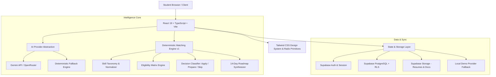

# InternSync Architecture Specification

## 1. System Overview
InternSync separates unstructured text understanding (handled by AI providers with strict schema enforcement) from deterministic decision logic (handled by client/edge scoring algorithms).

## 2. Layered Architecture

### A. Presentation Layer (`src/pages`, `src/components`)
- **Shell & Layout:** `AppShell`, `Sidebar`, `Topbar`, `CommandPalette` (`Cmd+K`).
- **Core Views:**
  - `Landing`: Value proposition, live mock opportunity card, core loop, feature pillars.
  - `Onboarding`: Multi-step profile builder with instant resume parsing.
  - `Dashboard`: Personalized greeting, readiness score (0-100), top opportunities, recommended next actions.
  - `Career DNA`: Multi-dimensional capability matrix, skill confidence bars, project evidence cards.
  - `Opportunities`: Search, multi-facet filtering, sorting, 3-way side-by-side comparison.
  - `Opportunity Detail`: Explainable match breakdown, missing skills, 14-day roadmap, company data.
  - `Skill Lab`: Interactive 5–10 question assessments with real-time scoring and badge verification.
  - `Career Paths`: Direction discovery quiz recommending AI Eng, Full-Stack, Data Science, etc.
  - `Applications`: Drag-and-drop Kanban pipeline with 7 stages and activity notes.
  - `AI Assistant`: Claude/Linear-styled contextual career advisor.

### B. Core Intelligence Layer (`src/lib/matching`, `src/lib/ai`)
- **AI Provider Abstraction (`AIProvider`):** Unified interface for resume analysis, opportunity parsing, match explanations, and conversational advice.
- **Deterministic Matcher:**
  - Weights:
    - Skill Compatibility: 30%
    - Eligibility (Year/Degree): 20%
    - Project Evidence: 15%
    - Education: 10%
    - Experience: 10%
    - Location Compatibility: 5%
    - Availability: 5%
    - Career Intent Alignment: 5%
  - Total normalized to 0–100%.

### C. Backend & Data Layer (`supabase/`, `src/lib/supabase`)
- Relational schema with Foreign Keys, Cascades, Indexes, and Row Level Security (RLS).
- Offline-first Demo Adapter ensuring 100% functionality during hackathons and live evaluations even without active internet or external keys.
